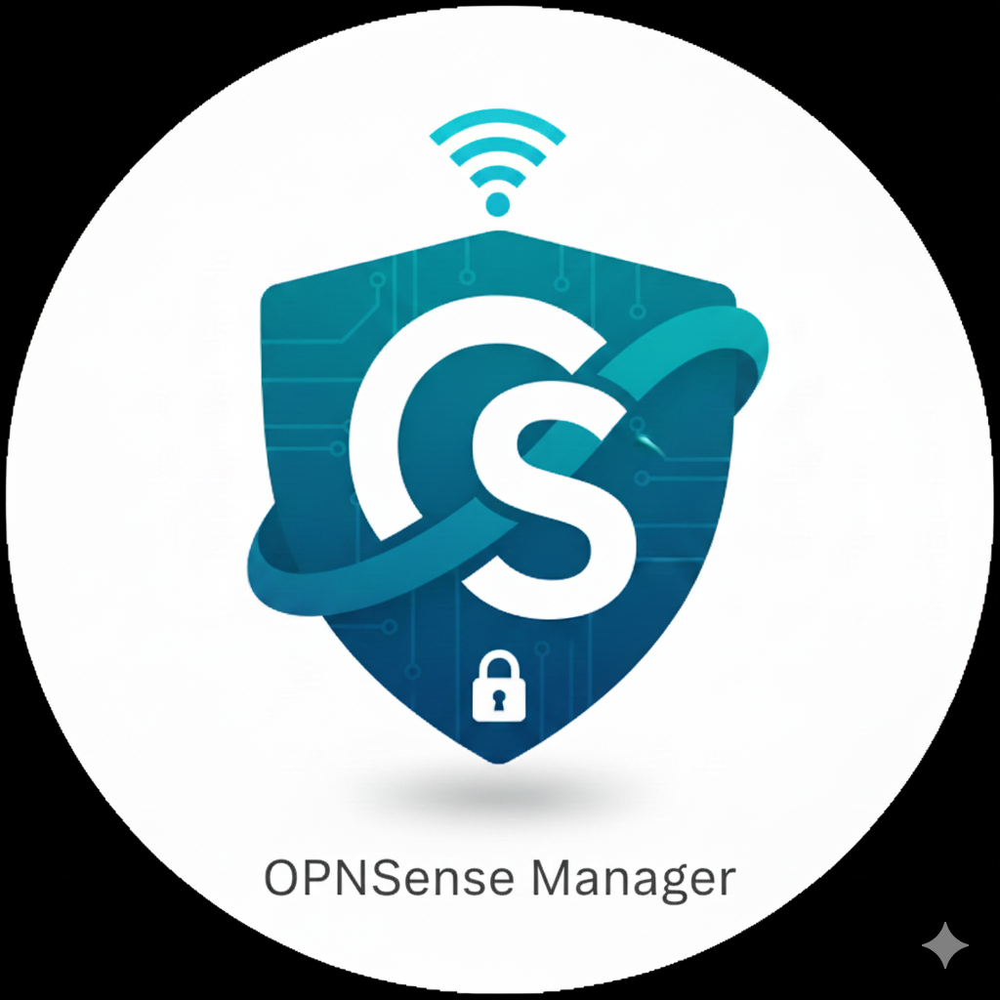
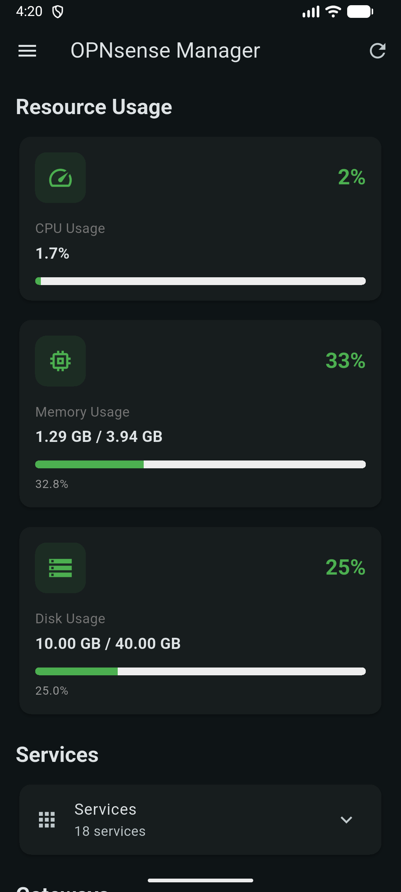
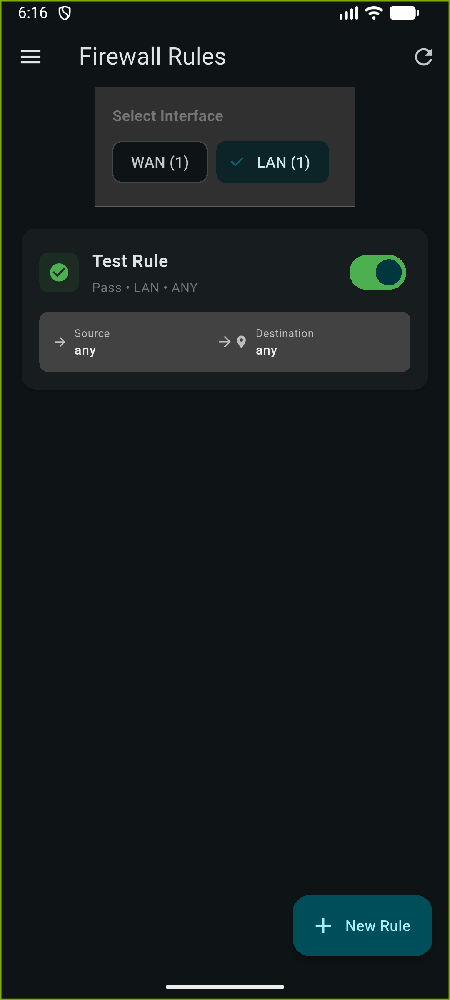
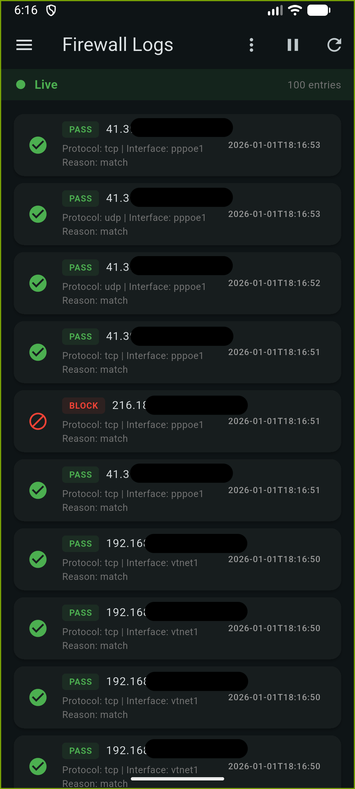
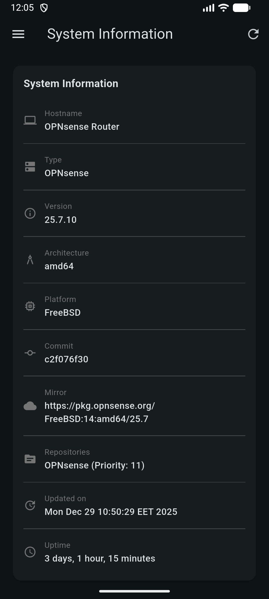
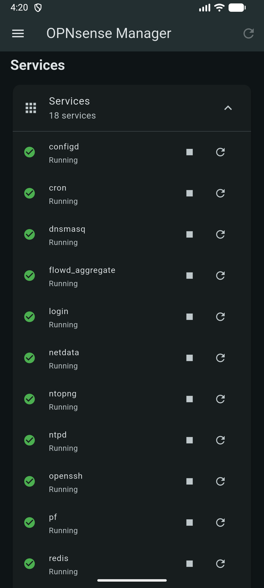
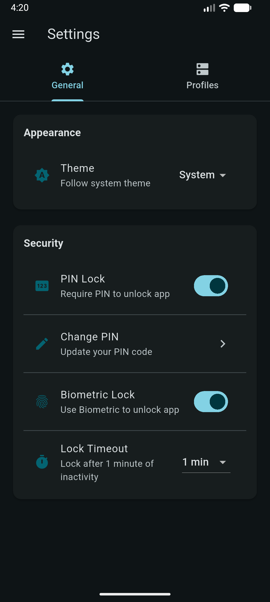

[![Contributors][contributors-shield]][contributors-url]
[![Forks][forks-shield]][forks-url]
[![Stargazers][stars-shield]][stars-url]
[![Issues][issues-shield]][issues-url]

 

  

  <h3 align="center">OPNsense Manager</h3>

## ❤️ Support the Project

If you find this project useful, consider supporting its development:

<!-- TABLE OF CONTENTS -->

  
Table of Contents

  <ol>
    <li>
      <a href="#about-the-project">📖 About The Project</a>
    </li>
    <li>
      <a href="#getting-started">🚀 Getting Started</a>
      <ul>
        <li><a href="#requirements">📋 Requirements</a></li>
        <li><a href="#configure-opnsense-api">🔧 Configure OPNsense API</a></li>
        <li><a href="#installation">📥 Installation</a></li>
      </ul>
    </li>
    <li><a href="#features">✨ Features</a></li>
    <ul>
        <li><a href="#authentication-security">🔐 Authentication & Security</a></li>
        <li><a href="#dashboard">📊 Dashboard</a></li>
        <li><a href="#firewall-management">🔥 Firewall Management (Currently only works with "Firewall > Automation > Filter" rules)</a></li>
        <li><a href="#firewall-logs">📋 Firewall Logs</a></li>
        <li><a href="#system-info">ℹ️ System Information</a></li>
        <li><a href="#service-management">🔧 Service Management</a></li>
        <li><a href="#settings">⚙️ Settings</a></li>
        <li><a href="#additional-features">🔄 Additional Features</a></li>
      </ul>
    <li><a href="#security-considerations">🛡️ Security Considerations</a></li>
    <li><a href="#roadmap">🗺️ Roadmap</a></li>
    <li><a href="#contributing">🤝 Contributing</a></li>
    <li><a href="#troubleshooting">🐛 Troubleshooting</a></li>
    <li><a href="#license">📄 License</a></li>
    <li><a href="#getting-help">💬 Getting Help</a></li>
    <li><a href="#acknowledgments">🙏 Acknowledgments</a></li>
  </ol>

## 📖 About The Project

OPNsense is a professional Flutter mobile application for managing OPNsense firewall routers. Monitor system status, manage firewall rules, view logs, control services, and manage your network security from your mobile device.

I could not find an mobile application that can do what I needed so I decided to create my own and share it with the community.

(<a href="#readme-top">back to top</a>)

## 🚀 Getting Started

### 📋 Requirements

- **Android**: API 21 (Android 5.0) or higher
- **iOS**: iOS 12.0 or higher
- **OPNsense**: Version 20.7 or higher with API access enabled

### 🔧 Configure OPNsense API

On your OPNsense firewall:
1. Go to **System → Access → Users**
2. Create a new user or edit existing
3. Generate API credentials (Key + Secret)
4. Assign appropriate permissions:
   - **Firewall: Filter** - For firewall rule management
   - **Diagnostics: System** - For system information and logs
   - **System: Status** - For system status and services
   - **Core: Firmware** - For firmware information

### 📥 Installation

#### Option 1: Download Pre-built APK (Android)
1. Go to the [Releases](https://github.com/Etregin/OPNsense_Manager/releases) page
2. Download the latest APK file
3. Install on your Android device
4. Grant necessary permissions when prompted

#### Option 2: Build from Source
See [CONTRIBUTING.md](CONTRIBUTING.md) for detailed build instructions.

(<a href="#readme-top">back to top</a>)

## ✨ Features

### 🔐 Authentication & Security
- **Secure API Authentication**: API key/secret based authentication with encrypted storage
- **Multiple Profile Management**: Manage multiple OPNsense instances seamlessly
- **PIN Lock**: Secure app access with 4-6 digit PIN code
- **Biometric Authentication**: Face ID, Touch ID, or Fingerprint support
- **Auto-Lock**: Configurable session timeout with automatic locking
- **Secure Storage**: Platform-specific encrypted credential storage (Keychain/Keystore)

### 📊 Dashboard
- **System Overview**: Real-time display of hostname, version, and platform information
- **Resource Monitoring**: Live CPU and memory usage with visual indicators
- **Service Management**: View, start, stop, and restart system services with confirmation dialogs
- **Gateway Status**: Monitor gateway health and connectivity
- **System Uptime**: Formatted uptime display
- **Quick Navigation**: Easy access to all features from the main screen
- **Pull-to-Refresh**: Update data with a simple swipe gesture
- **Auto-Refresh**: Configurable automatic data updates

### 🔥 Firewall Management (Currently only works with "Firewall > Automation > Filter" rules)
- **View Rules**: List all firewall rules with detailed information and status
- **Create Rules**: Add new firewall rules with comprehensive configuration options
- **Edit Rules**: Modify existing rules with full parameter control
- **Delete Rules**: Remove unwanted rules with confirmation dialogs
- **Toggle Rules**: Enable/disable rules with a single tap
- **Rule Details**: View complete rule configuration including:
  - Action (Pass/Block/Reject)
  - Interface (WAN/LAN/OPT, etc.)
  - Protocol (TCP/UDP/ICMP/Any)
  - Source and destination addresses with CIDR notation
  - Port specifications and ranges
  - Rule descriptions and labels
  - Creation and modification timestamps
  

### 📋 Firewall Logs
- **Real-time Logs**: View firewall activity as it happens
- **Filter by Action**: Show only Pass, Block, or Reject events
- **Search Functionality**: Find specific log entries quickly
- **Detailed Information**: View packet details including:
  - Source and destination IP addresses
  - Source and destination ports
  - Protocol information
  - Timestamps with timezone
  - Rule IDs and actions
  - Interface information
- **Auto-Refresh**: Configurable automatic log updates (5-60 seconds)
- **Log Limit**: Adjustable number of log entries displayed

### ℹ️ System Information
- **Firmware Details**: 
  - System type (OPNsense)
  - Version number
  - Architecture (amd64, etc.)
  - Git commit hash
  - Package mirror URL
  - Repository information with priority
  - Last update timestamp
- **System Status**:
  - Hostname
  - Platform (FreeBSD version)
  - System uptime
- **Pull-to-Refresh**: Update system information on demand

### 🔧 Service Management
- **Service Control**: Start, stop, and restart system services
- **Service Status**: Real-time service status indicators
- **Confirmation Dialogs**: Prevent accidental service disruptions
- **Visual Feedback**: Color-coded status indicators (running/stopped)
- **Service List**: View all available system services

### ⚙️ Settings
- **Theme Control**: Toggle between light and dark modes
- **PIN Lock Configuration**: Set up and change PIN code
- **Biometric Setup**: Enable/disable biometric authentication
- **Session Timeout**: Configure auto-lock duration (1-60 minutes)
- **Profile Management**: 
  - Add new OPNsense profiles
  - Edit existing profiles
  - Delete profiles with confirmation
  - Switch between profiles instantly
  - Profile-specific credentials
- **App Lock**: Manually lock the app for security
- **About Screen**: View app information, version, and licenses

### 🔄 Additional Features
- **Firewall Reboot**: Remotely reboot your OPNsense firewall with confirmation
- **Profile Switching**: Quickly change between different OPNsense instances
- **Connection Testing**: Verify API connectivity before saving profiles
- **Error Handling**: Comprehensive error messages and recovery options
- **Offline Support**: Graceful handling of network issues
- **Material Design 3**: Modern, beautiful UI following Material Design guidelines
- **Responsive Layout**: Optimized for various screen sizes

(<a href="#readme-top">back to top</a>)

## 🛡️ Security Considerations

- ✅ API credentials stored using platform-specific secure storage (Keychain/Keystore)
- ✅ HTTPS enforced for all API communications
- ✅ Self-signed certificate support (configurable per profile)
- ✅ PIN lock with biometric authentication
- ✅ Auto-lock on app background
- ✅ No credentials logged or exposed in production
- ✅ Confirmation dialogs for destructive actions
- ✅ Session timeout for automatic security
- ⚠️ Certificate pinning not implemented (consider for production environments)

(<a href="#readme-top">back to top</a>)

## 🗺️ Roadmap
- [ ] Get Firewall rules to work with ALL rules
- [ ] VPN connection management (OpenVPN, WireGuard)
- [ ] Push notifications for system alerts
- [ ] Backup/restore configuration functionality
- [ ] Package management interface
- [ ] Multi-language support (i18n)
- [ ] Tablet-optimized layouts
- [ ] Traffic monitoring with detailed charts
- [ ] Bandwidth quota management
- [ ] Interface statistics and graphs
- [ ] DHCP lease management
- [ ] DNS configuration
- [ ] Certificate management
- [ ] User management interface
- [ ] Scheduled tasks/cron jobs
- [ ] Plugin management
- [ ] Export/import profiles

See the [open issues](issues-url) for a full list of proposed features (and known issues).

(<a href="#readme-top">back to top</a>)

## 🤝 Contributing

Contributions are what make the open source community such an amazing place to learn, inspire, and create. Any contributions you make are **greatly appreciated**.

If you have a suggestion that would make this better, please fork the repo and create a pull request. You can also simply open an issue with the tag "enhancement". 

Review [CONTRIBUTING.md](CONTRIBUTING.md) for ways to get started.

Don't forget to give the project a star! Thanks again!

### ➕ Adding a Feature

1. **Fork the repository**
2. **Create a feature branch**: `git checkout -b feature/amazing-feature`
3. **Follow the code style**: Use `flutter analyze` and fix any issues
4. **Write meaningful commit messages**
5. **Test your changes** thoroughly on both Android and iOS if possible
6. **Update documentation** if needed
7. **Submit a pull request** with a clear description of changes

### 🐞 Reporting a Bug

**Check existing issues** to avoid duplicates, **Use the issue template** when creating new issues and **Provide detailed information**:

- App version
- Device and OS version
- OPNsense version
- Steps to reproduce
- Expected vs actual behavior
- Screenshots if applicable
- Error messages or logs

(<a href="#readme-top">back to top</a>)

## 🐛 Troubleshooting

### API Connection Issues
- Verify OPNsense API is enabled in System → Settings → Administration
- Check firewall rules allow connections from mobile device IP
- Confirm API key/secret are correct and not expired
- Test HTTPS certificate (allow self-signed certificates in profile settings)
- Verify API user has required permissions

### Biometric Authentication Not Working
- Ensure device has biometric hardware (fingerprint sensor, Face ID, etc.)
- Check app permissions are granted in device settings
- Verify biometric is enrolled on device
- Try disabling and re-enabling biometric in app settings

### Service Control Not Working
- Verify API user has System: Status permissions
- Check service names match OPNsense service IDs
- Ensure services are installed and available on your OPNsense instance

(<a href="#readme-top">back to top</a>)

## 📄 License

This project is licensed under the GNU General Public License v3.0 - see the [LICENSE](LICENSE) file for details.

### ❓ Why GPLv3?

We chose GPLv3 to ensure that:
- The software remains free and open source
- Any modifications or derivatives must also be open source
- Users have the freedom to use, study, share, and modify the software
- The community benefits from improvements and contributions

(<a href="#readme-top">back to top</a>)

## 💬 Getting Help

- **Issues**: [GitHub Issues](https://github.com/Etregin/OPNsense_Manager/issues)
- **Discussions**: [GitHub Discussions](https://github.com/Etregin/OPNsense_Manager/discussions)
- **Email**: Etreginwow@gmail.com

### 🔒 Reporting Security Issues

If you discover a security vulnerability, please email Etreginwow@gmail.com instead of using the issue tracker.

(<a href="#readme-top">back to top</a>)

## 🙏 Acknowledgments

- OPNsense team for the excellent firewall platform

(<a href="#readme-top">back to top</a>)

<!-- GitHub Badges -->
[contributors-shield]: https://img.shields.io/badge/contributors-—-green?style=for-the-badge
[contributors-url]: https://github.com/Etregin/OPNsense_Manager/graphs/contributors

[forks-shield]: https://img.shields.io/badge/forks-—-blue?style=for-the-badge
[forks-url]: https://github.com/Etregin/OPNsense_Manager/network/members

[stars-shield]: https://img.shields.io/badge/stars-—-blue?style=for-the-badge
[stars-url]: https://github.com/Etregin/OPNsense_Manager/stargazers

[issues-shield]: https://img.shields.io/badge/issues-—-yellow?style=for-the-badge
[issues-url]: https://github.com/Etregin/OPNsense_Manager/issues

[license-shield]: https://img.shields.io/badge/License-GPLv3-blue
[license-url]: https://github.com/Etregin/OPNsense_Manager/blob/main/LICENSE